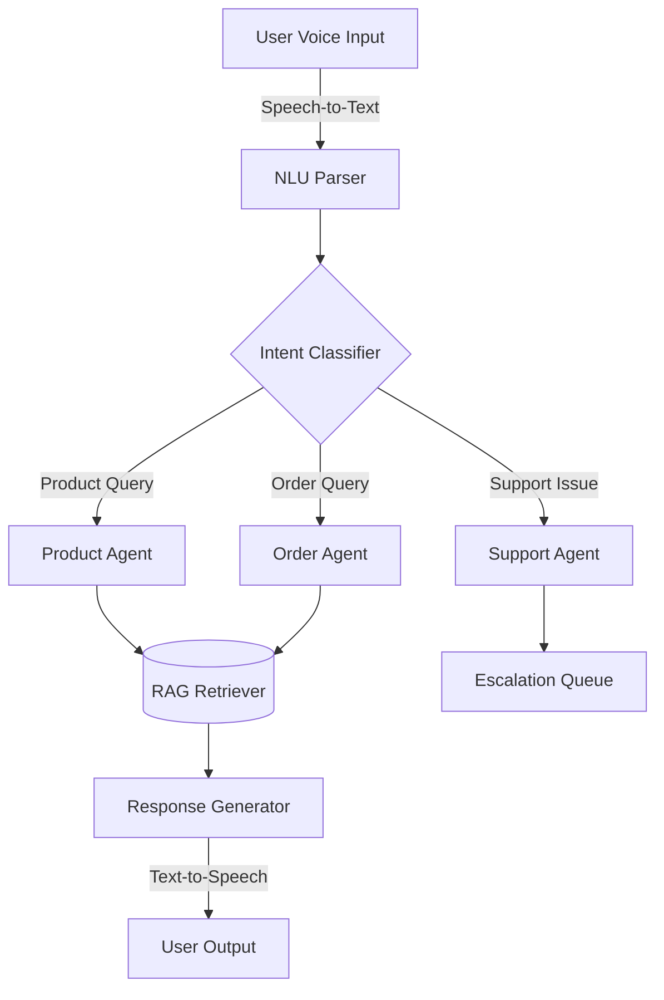
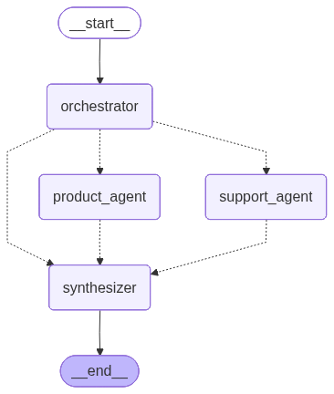
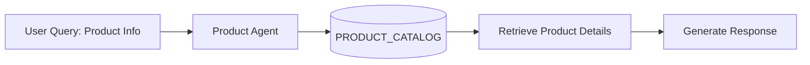
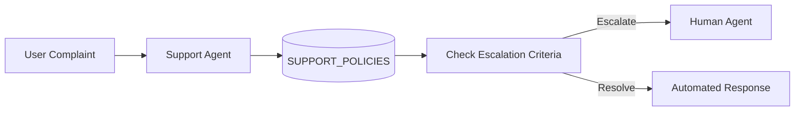
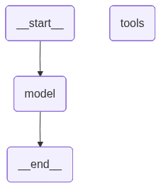

# 🧠 Multi-Agent Voice Assistant

An **AI-powered multi-agent voice assistant** built in Python that integrates **retrieval-augmented generation (RAG)**, **tool-based reasoning**, and **contextual memory** to simulate a real-world intelligent support system.

---

## 🚀 Features

- **Multi-Agent Architecture** — Specialized agents for product queries, order tracking, and customer support.
- **Retrieval-Augmented Generation (RAG)** — Uses structured data from [`src/data.py`](src/data.py) for factual grounding.
- **Voice Interaction** — Can be extended to use speech-to-text and text-to-speech modules.
- **Escalation System** — Automatically routes complex or emotional queries to human agents.
- **Support Policies** — Built-in policy engine for shipping, returns, and escalation.

---

## 🧩 Folder Structure

```bash
Multi-Agent-Voice-Assistant/
├── src/
│   ├── __init__.py          # Package initializer
│   ├── config.py            # Configuration and constants
│   ├── data.py              # Base dataset (products, orders, policies)
│
├── requirements.txt         # Python dependencies
├── README.md                # Project documentation
└── .gitignore               # Git ignore rules
```

---

## 🧠 System Architecture





---

### 🛍️ Product Agent Subgraph




---

### 💬 Support Agent Subgraph





---

## 🧰 Setup Instructions

### 1️⃣ Clone the Repository

```bash
git clone https://github.com/yourusername/Multi-Agent-Voice-Assistant.git
cd Multi-Agent-Voice-Assistant
```

### 2️⃣ Create a Virtual Environment

```bash
python3 -m venv venv
source venv/bin/activate   # On macOS/Linux
# OR
venv\Scripts\activate      # On Windows
```

### 3️⃣ Install Dependencies

```bash
pip install -r requirements.txt
```

### 4️⃣ Run a Module

You can run any Python module directly using:

```bash
python -m src.data
```

This will load the static datasets and can be extended to integrate with the assistant logic.

---

## 🧪 Example Usage

```python
from src import data

# Access product catalog
for product in data.PRODUCT_CATALOG:
    print(product["name"], "- ₹", product["price"])

# Check order status
order = data.ORDER_DATABASE.get("ORD202")
print(f"Order {order['product']} is currently {order['status']}")
```

---

## 🧭 Future Enhancements

- Integrate **OpenAI GPT-4** or **Anthropic Claude** for reasoning.
- Add **speech recognition (Whisper)** and **TTS (gTTS or ElevenLabs)**.
- Implement **memory persistence** using SQLite or Redis.
- Add **web dashboard** for monitoring agent interactions.

---

## 🧑‍💻 Author

**Kanav Gupta**  

---

## 📜 License

This project is licensed under the **MIT License** — feel free to use and modify it.
